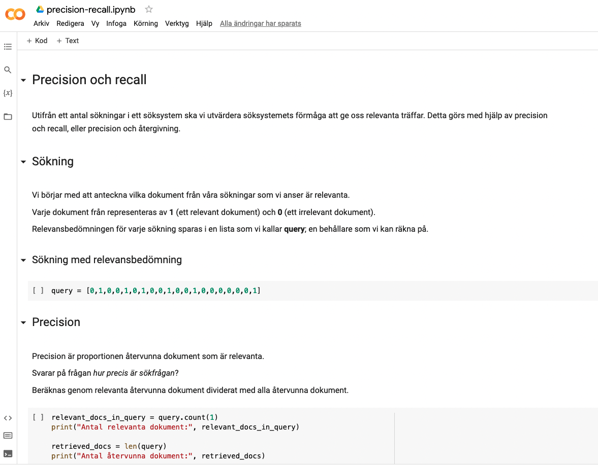
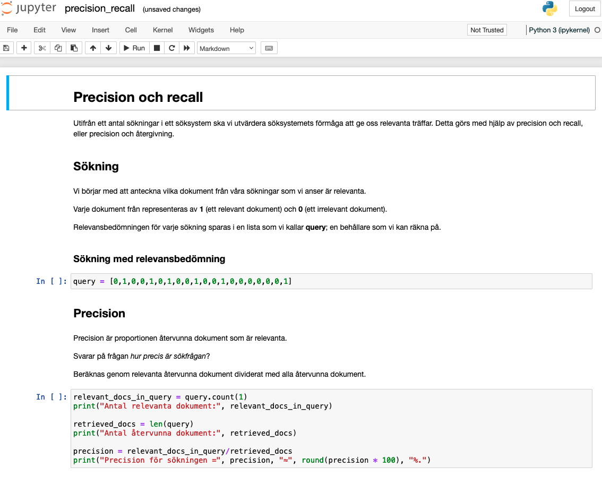

Kort instruktion för att komma igång med Python-notebooken precision-recall.ipynb för att beräkna precision, recall och flera andra evalueringsmått.

# Google Colab

(Kräver ett Google-konto)

* Hämta precision-recall.ipynb till din hårddisk.
* Navigera till Google Colab: https://colab.research.google.com/.
* Välj Arkiv -> Öppna anteckningsbok.
* Navigera till den plats på din hårddisk där du sparat precision-recall.ipynb.
* Klicka på filen.
* Följ instruktionerna och klicka på Play-knappen bredvid varje kodruta för att köra koden.

\newpage

# Jupyter Notebook

(Kräver installation av ett Python-gränssnitt, t ex Anaconda)

* Hämta filen precision-recall.ipynb till din hårddisk.
* Ladda ner och installera Anaconda: https://www.anaconda.com/products/individual
* Öppna Jupyter Notebook via Anaconda Navigator.
* Välj File -> Open...
* Navigera till den plats på din hårddisk där du sparat precision-recall.ipynb.
* Klicka på filen.
* Följ instruktionerna och klicka på Play-knappen bredvid varje kodruta för att köra koden.

